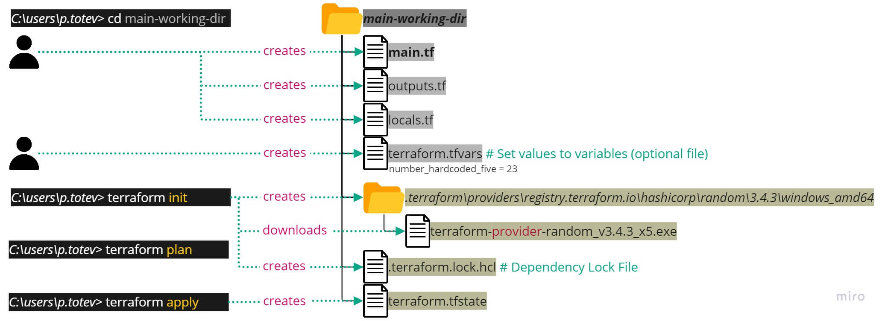

# PT_Demo_Terraform

## Content

- [General Information](#general-information)
- [Workflow](#workflow)
- [Demos](#demos)
  - [Demo1 Local In Output](#demo1-local-in-output)
  - [Demo2 Vars From Cmd Apply](#demo2-vars-from-cmd-apply)
  - [Demo2 Vars From Env Vars](#demo2-vars-from-env-vars)
  - [Demo2 Vars From File Auto Tfvars](#demo2-vars-from-file-auto-tfvars)
  - [Demo2 Vars From File MyFile Tfvars](#demo2-vars-from-file-myfile-tfvars)
  - [Demo2 Vars From File Terraform Tfvars](#demo2-vars-from-file-terraform-tfvars)
---

## General Information

PT_Demo_Terraform is a demo project to test Terraform.

---

## Workflow

---

## Demos

### Demo1 Local In Output

Your text here.

---

### Demo2 Vars From Cmd Apply

Your text here.

---

### Demo2 Vars From Env Vars

Your text here.

---

### Demo2 Vars From File Auto Tfvars

1. One must create any file with suffix `auto.tfvars` that contains the values for variables (for example `somefile.auto.tfvars`).  
2. `terraform apply` command will find such files, take the values from them and apply those.

---

### Demo2 Vars From File MyFile Tfvars

1. One must create any file of type `.tfvars` that contains the values for variables (for example `myfile.tfvars`).  
2. `terraform apply -var-file="myfile.tfvars"` command instructs Terraform to take the values from this file and apply those.

---

### Demo2 Vars From File Terraform Tfvars

1. One must create a file named exactly `terraform.tfvars` - containing the values for variables.  
2. `terraform apply` command takes the values from the `terraform.tfvars` file and apply those.

---